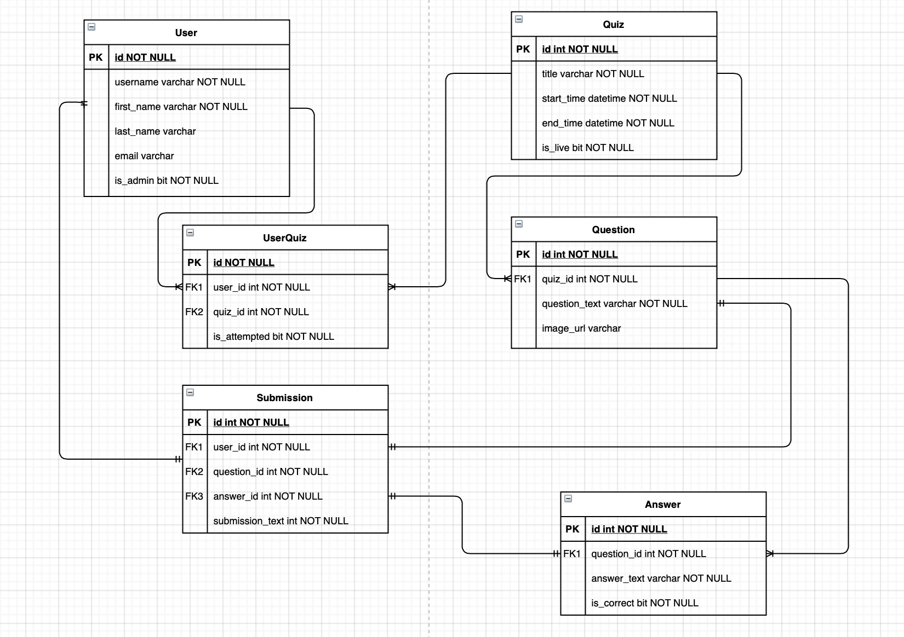

# PyQuiz

**_A minimal yet robust API for Quiz applications built with Django and the Django REST Framework._**

## Getting Started

### Setup

Install dependencies

```sh
pipenv install
```

Sync migrations

```sh
python3 PyQuiz/manage.py migrate
```

Serve API on localhost:8000

```sh
python3 PyQuiz/manage.py runserver
```

### Endpoints and Requests

**For available options, make an `OPTIONS` request at REST API Root `http://localhost:8000/quizzes/`**

- CRUD functionality for the User model is available at `http://localhost:8000/users/api/`

- CRUD functionality for the Quiz model is available at `http://localhost:8000/quizzes/api/`

- CRUD functionality for the Question model is available at `http://localhost:8000/quizzes/question/api/`

- CRUD functionality for the Answer model is available at `http://localhost:8000/quizzes/answers/api`

- Submission is implemented at `http://localhost:8000/quizzes/submission/api`

## DB Design

<p align="center">
  
</p>
